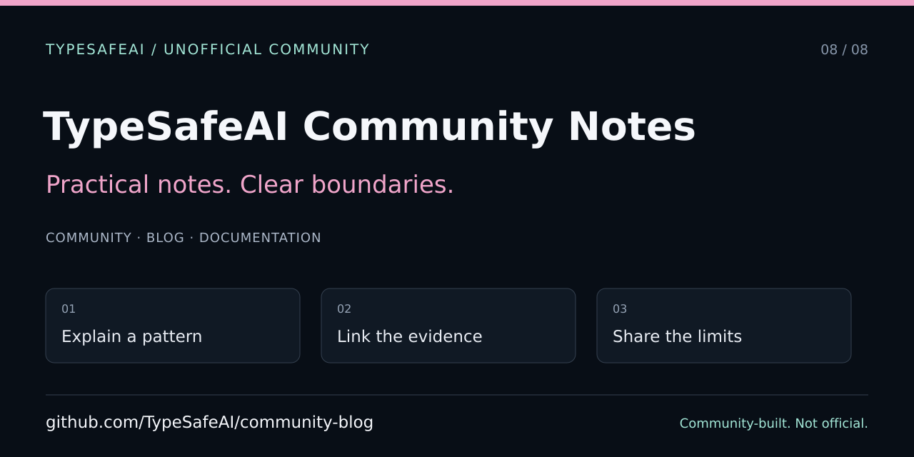

# TypeSafeAI Community Notes

> **Unofficial community project — not the official TypeSafe AI blog or team.** Community organization created by VC Moderator [@BunsDev](https://github.com/BunsDev).

A dependency-free static site for introductory community notes about typed decisions, tool interfaces, and developer workflows. The current entries are short introductory notes, not published benchmarks, official product announcements, or claims of production safety.



[Contributing](CONTRIBUTING.md) · [Agent instructions](AGENTS.md) · [Publishing guide](docs/discovery/README.md) · [Machine-readable navigation](llms.txt)

## Preview locally

Open `index.html` in a browser, or serve the repository using Python's local static server:

```sh
python3 -m http.server 8080 --bind 127.0.0.1
```

Visit `http://127.0.0.1:8080`. No package installation, API key, build step, analytics account, or provider call is required. Binding to loopback avoids exposing a development server to other machines.

## Project map

- `index.html`: the full static page, styles, article anchors, and metadata.
- `tests/test_site.py`: dependency-free checks for discovery metadata, community identity, and article links.
- `docs/discovery/`: editorial card and publishing/screenshot guidance.
- `repository-metadata.json`: intended GitHub About/topics, not applied settings.

## Edit and verify

Keep semantic headings and stable article IDs. Link article headings to their fragments so individual notes can be shared within the page. Add a source, concrete example, and limitations to substantive new claims. Do not invent authors, experiment results, dates, deployments, or vendor endorsement.

```sh
python3 -m unittest discover -s tests -v
```

Also inspect the actual page at desktop and mobile widths, keyboard focus, article anchors, and links. Record the source commit and capture environment for screenshots. The SVG above is editorial artwork, not a screenshot.

## Deployment and sharing

This repository does not establish a confirmed production origin. The page has title/description and text-card metadata, but deliberately does not invent a canonical URL, sitemap, or absolute OG image URL. Once a public host is chosen, verify its origin and a publicly accessible raster image before adding those values and updating the relevant tests. See the [publishing guide](docs/discovery/README.md).

The GitHub About/topics manifest does not itself change repository settings. Do not treat a merged source change as deployed-site evidence.

## Attribution and reuse

Keep the unofficial notice, original credits, and any third-party notices. No license is added or changed by this documentation work; public availability alone does not establish permission to reuse unlicensed material. Official product and API resources are [typesafe.ai](https://typesafe.ai) and [docs.typesafe.ai](https://docs.typesafe.ai), separate from this community site.
